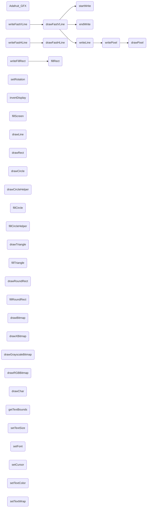

```mermaid
flowchart LR
Adafruit_GF(Adafruit_GFX)
drawPixel(drawPixel)
startWrite(startWrite)
endWrite(endWrite)
writePixel(writePixel)
writeFillRect(writeFillRect)
writeFastVLine(writeFastVLine)
writeFastHLine(writeFastHLine)
writeLine(writeLine)
setRotation(setRotation)
invertDisplay(invertDisplay)
drawFastVLine(drawFastVLine)
drawFastHLine(drawFastHLine)
fillRect(fillRect)
fillScreen(fillScreen)
drawLine(drawLine)
drawRect(drawRect)
drawCircle(drawCircle)
drawCircleHelper(drawCircleHelper)
fillCircle(fillCircle)
fillCircleHelper(fillCircleHelper)
drawTriangle(drawTriangle)
fillTriangle(fillTriangle)
drawRoundRect(drawRoundRect)
fillRoundRect(fillRoundRect)
drawBitmap(drawBitmap)
drawXBitmap(drawXBitmap)
drawGrayscaleBitmap(drawGrayscaleBitmap)
drawRGBBitmap(drawRGBBitmap)
drawChar(drawChar)
getTextBounds(getTextBounds)
setTextSize(setTextSize)
setFont(setFont)
setCursor(setCursor)
setTextColor(setTextColor)
setTextWrap(setTextWrap)


writeFastVLine --> drawFastVLine --> writeLine --> writePixel --> drawPixel
drawFastVLine --> startWrite & endWrite

writeFastHLine --> drawFastHLine
writeFillRect --> fillRect

```