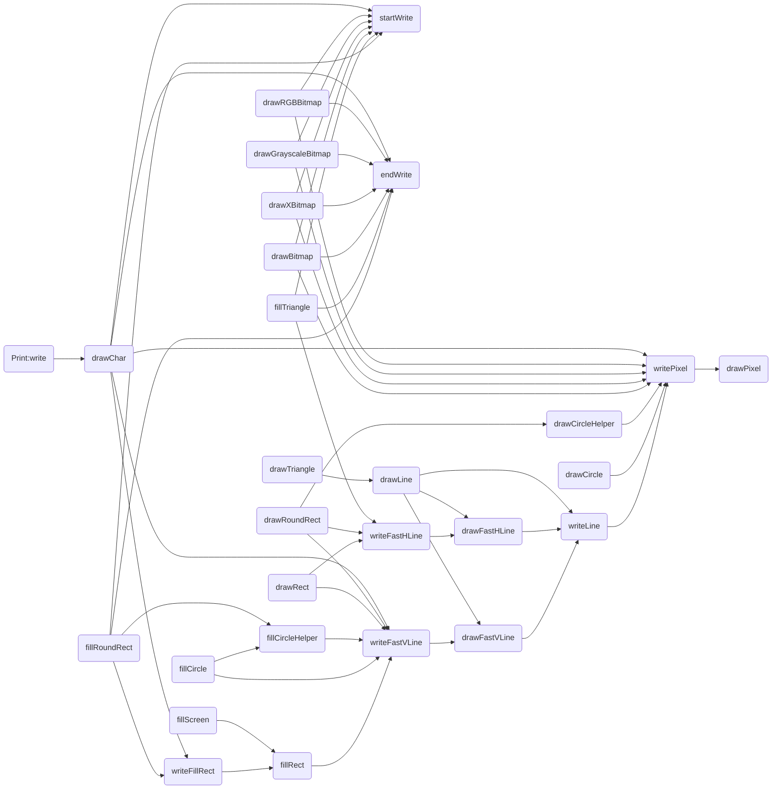

```mermaid
flowchart LR

drawPixel(drawPixel)
startWrite(startWrite)
endWrite(endWrite)
writePixel(writePixel)
writeFillRect(writeFillRect)
writeFastVLine(writeFastVLine)
writeFastHLine(writeFastHLine)
writeLine(writeLine)
drawFastVLine(drawFastVLine)
drawFastHLine(drawFastHLine)
fillRect(fillRect)
fillScreen(fillScreen)
drawLine(drawLine)
drawRect(drawRect)
drawCircle(drawCircle)
drawCircleHelper(drawCircleHelper)
fillCircle(fillCircle)
fillCircleHelper(fillCircleHelper)
drawTriangle(drawTriangle)
fillTriangle(fillTriangle)
drawRoundRect(drawRoundRect)
fillRoundRect(fillRoundRect)
drawBitmap(drawBitmap)
drawXBitmap(drawXBitmap)
drawGrayscaleBitmap(drawGrayscaleBitmap)
drawRGBBitmap(drawRGBBitmap)
drawChar(drawChar)
write(Print:write)


writeLine --> writePixel --> drawPixel

writeFastVLine --> drawFastVLine
drawFastVLine --> writeLine

writeFastHLine --> drawFastHLine
drawFastHLine --> writeLine

writeFillRect --> fillRect --> writeFastVLine

fillScreen --> fillRect
drawLine --> drawFastVLine & drawFastHLine &  writeLine
drawCircle -->  writePixel
drawCircleHelper --> writePixel
fillCircle --> writeFastVLine & fillCircleHelper
fillCircleHelper --> writeFastVLine
drawRect --> writeFastHLine & writeFastVLine
drawRoundRect --> writeFastHLine & writeFastVLine & drawCircleHelper
fillRoundRect --> startWrite & endWrite & writeFillRect & fillCircleHelper
drawTriangle --> drawLine
fillTriangle --> startWrite & endWrite & writeFastHLine
drawBitmap --> startWrite & endWrite & writePixel
drawXBitmap --> startWrite & endWrite & writePixel
drawGrayscaleBitmap --> startWrite & endWrite & writePixel
drawRGBBitmap --> startWrite & endWrite & writePixel
drawChar --> startWrite & endWrite & writePixel & writeFillRect & writeFastVLine
write --> drawChar
```